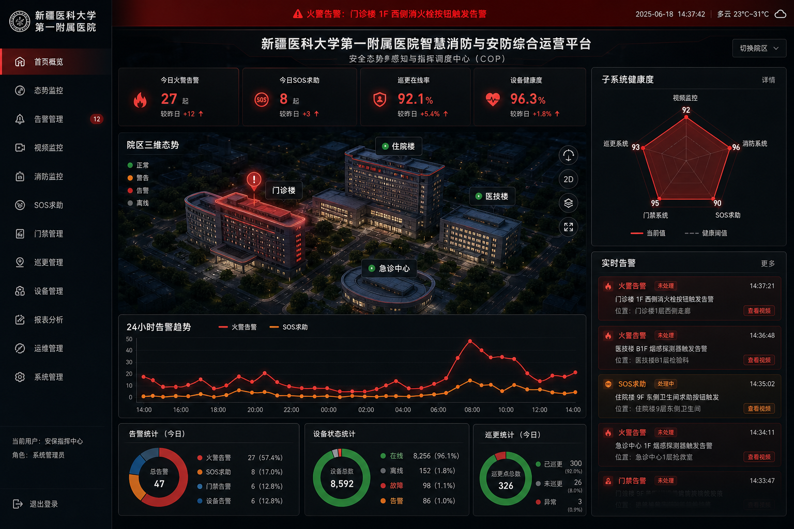

# 新疆医科大学第一附属医院智慧消防系统等5项采购项目 (XZJ266-100（3）-ZK)

> 部署域名 (Host): [https://26-xj-fire-bid.softwarelink.net/](https://26-xj-fire-bid.softwarelink.net/)  
> 项目仓库 (Repo): [https://github.com/softwarelink-net/26-xj-fire-bid](https://github.com/softwarelink-net/26-xj-fire-bid)



---

## 部署与运行说明

### 环境要求
- Node.js >= 18.0.0
- npm >= 9.0.0 或 pnpm >= 8.0.0
- Cloudflare Wrangler CLI >= 3.0.0

### 安装依赖
```bash
npm install
```

### 本地运行
```bash
# 启动前端本地开发服务器
npm run dev

# 启动本地 Cloudflare Worker 模拟环境
npx wrangler dev
```

### 演示账号一览
| 账号名称 | 登录账号 | 默认密码 | 角色权限 |
| :--- | :--- | :--- | :--- |
| 保卫处超管 | `admin` | `Admin@2026` | `ROLE_SUPER_ADMIN` (系统超级管理员) |
| 安防值班长 | `dispatcher` | `Dispatch@2026` | `ROLE_SECURITY_DISPATCHER` (安防监控中心值班长) |
| 巡更安保员 | `guard` | `Guard@2026` | `ROLE_PATROL_GUARD` (院区巡更安保专员) |
| 决策研判长 | `leader` | `Leader@2026` | `ROLE_DECISION_MAKER` (决策研判领导) |

### 生产构建与部署到 Cloudflare
```bash
# 1. 前端生产构建打包
npm run build

# 2. 部署共享 Cloudflare Worker (allworld)
npm run deploy:worker

# 3. 同步前端静态构建产物至 R2 存储桶
npm run upload:r2
```

### 常用脚本一览
- `npm run dev`: 本地启动 Vite 开发服务
- `npm run build`: 前端生产构建并输出到 dist 目录
- `npm run lint`: 检查与修复 TypeScript / Vue 代码格式
- `npm run db:migrate`: 执行 Cloudflare D1 数据库结构迁移
- `npm run db:seed`: 注入新医大一附院智慧消防安防演示种子数据

### 目录结构
```text
26-xj-fire-bid/
├── docs/
│   └── assets/
│       └── dashboard-preview.png
├── src/
│   ├── assets/
│   ├── components/
│   │   ├── common/
│   │   │   └── GlobalStickyBanner.vue
│   │   └── layout/
│   ├── layouts/
│   │   ├── AuthLayout.vue
│   │   └── MainLayout.vue
│   ├── router/
│   │   └── index.ts
│   ├── stores/
│   ├── views/
│   │   ├── auth/
│   │   ├── dashboard/
│   │   ├── iot-center/
│   │   ├── alarms/
│   │   ├── patrol/
│   │   └── system/
│   ├── App.vue
│   └── main.ts
├── worker/
│   ├── index.ts
│   ├── router.ts
│   └── handlers/
├── schema.sql
├── wrangler.toml
├── package.json
└── README.md
```

---

## 招标公告全文

### 1. 标题
新疆医科大学第一附属医院智慧消防系统等5项采购项目公开招标公告

### 2. 项目发包方
新疆医科大学第一附属医院

### 3. 项目编号
XZJ266-100（3）-ZK

### 4. 项目发布时间
2026-08-13 19:01

### 5. 关键词
新疆医科大学第一附属医院, 智慧消防系统, 视频监控系统, 门禁一卡通, 弱电智能化, XZJ266-100（3）-ZK, 医院安防采购, 新疆政府采购

### 6. 摘要
新疆医科大学第一附属医院公开招标智慧消防系统等5项采购项目，预算金额922,215.12元，包含视频监控系统、入侵报警及紧急求助系统、门禁及一卡通系统、电子巡更系统、智慧消防系统各1套。投标人须具备电子与智能化工程专业承包二级及以上资质且具备安全生产许可证，通过政采云平台线上投标，投标文件递交截止时间为2026年9月4日16:00。

### 7. 技术要点
- **五大异构弱电子系统全域融合**：深度集成视频监控、入侵报警/紧急求助、门禁一卡通、电子巡更、智慧消防 5 套系统。
- **跨系统秒级应急协同与联动编排**：支持火灾与求助信号触发多路视频自动切换、门禁紧急疏散释放与广播联动。
- **电子巡更与隐患闭环流转**：实现巡更点位 RFID/蓝牙精准核验与通道堵塞、设备损坏等隐患工单全流程追溯。
- **信创国密脱敏与极简 Serverless 架构**：敏感人员信息国密 SM4 动态脱敏，基于 Cloudflare Workers + D1 高性能承载。

### 8. 技术创新性
- **医院三维空间与安防消防态势感知雷达**：立体呈现门诊楼、住院楼与医技楼等重点部位设备运行与隐患分布。
- **智能医护紧急求助一键处置链条**：融合求助弹窗、就近安保定位与视频跟踪，实现 1 分钟快速到达现场响应。

---

## 免责声明

1. **数据来源与合规性**：本系统展示的所有招标信息、项目背景及采购需求均来源于公开招投标平台（如中国招标投标公共服务平台、中国建设银行龙集采平台等）。系统仅用于技术方案演示、架构原型验证与演示搭建，不涉及任何商业非法抓取或数据篡改。
2. **技术实现路径**：本系统前端基于 Vue 3 + Tailwind CSS 构建，后端基于 Cloudflare Workers 极简无服务器架构，数据存储采用 Cloudflare D1 关系型数据库，完整符合分布式高可用与银企对接安全标准。
3. **保密承诺**：开发团队严格遵守保密义务，系统内示例数据均经过伪化脱敏处理（Anonymized），不包含真实患者医疗健康信息（PHI）或建行敏感金融交易数据。
4. **知识产权与巧合声明**：本系统中涉及的商标、机构名称（中国建设银行、川北医学院附属医院等）归各自合法持有人所有。演示代码与系统架构若与实际投产系统存在相似之处，纯属技术通用设计之巧合。
5. **免责条款**：本演示系统不具备实际金融扣款功能，不承担因非授权使用、不可抗力或第三方平台接口变更所导致的任何法律责任与经济损失。
